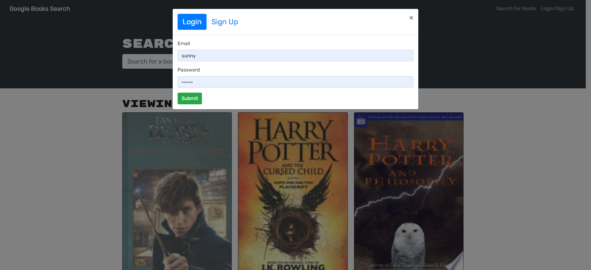
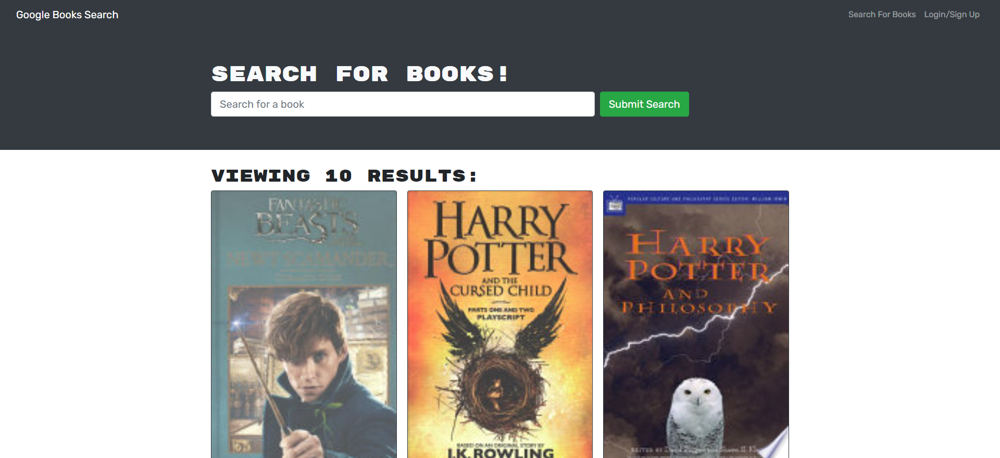

# Book-Search-Engine

 

## Description

This app converts a fully functioning Google Books API search engine built with a RESTful API into a GraphQL API built with Apollo Server. Uses the MERN stack, with a React front end, MongoDB database, and Node.js/Express.js server and API.

## Deployed application Link

https://sleepy-dawn-31613.herokuapp.com/

## Table of Contents:

- [Installation](#installation)
- [Usage](#usage)
- [License](#license)
- [Questions](#questions)
- [Demo](#demo)

## Installation

- clone the repository

https://github.com/vjain83/book-search-engine

- cd book-search-engine
- npm install
- npm run develop

### demo

https://youtu.be/MLqIsII9Wdo

### License:

### Screenshot:

### Questions:

If you have any questions email me or reach out on:

- Varsha Jain - csvarshajain@gmail.com
- [Github](https://github.com/vjain83)
